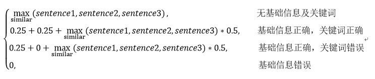

#SMP2023
比赛链接 https://tianchi.aliyun.com/competition/entrance/532126/introduction
## 赛制

### 报名
* 8月16日上午10:00 报名、组队 所有人实名认证
### 初赛 2023年7月24日-8月16日
* 每天提供3次提交机会 
* 排行榜展示历史最优成绩进行
* 最后一次评测截止时间为8月16日18:00（三周）
* 初赛排名前40名的参赛队伍将进入复赛，复赛名单将在8月17日公布
* 各参赛队伍**可以使用除承办方提供的训练数据之外的标注数据**，如若不确定外部数据是否可用，请发邮件与组委会联系。评测会务组邮箱：w_chen@bjtu.edu.cn
### 复赛 2023年8月17日-8月29日
* 最后一次评测截止时间为8月29日18:00
* 2023年8月30日10:00，复赛阶段排名前8名队伍晋级决赛答辩环节，组委会将进行代码审核，审核不通过的队伍将被取消决赛答辩资格，晋级名额将依据排行榜顺延
### 决赛答辩 2023年9月
* 材料准备：答辩PPT、参赛总结、核心代码
* 打分依据：选手的技术思路、理论深度和答辩表现综合评分
* 决赛分数：复赛线上成绩占60%，决赛答辩成绩占40%
###赛中激励  第一个达到60分和70分的现金1000元

## 赛题
* 基于年报的问答系统
* 大模型只能用ChatGLM2-6B,需要公开
* 可以使用其他公开访问的外部数据来微调模型，**包括自有的金融领域(有标注/无标注)数据，需要在最终提交文件中注明其训练数据来源及处理方法**（东财数据库？）
* 也可以使用向量数据库等技术
###评测标准
* 初级：数据基本查询（40分）
参赛者需要利用提供的ChatGLM2-6B开源模型和上市公司年报原始数据，并以此为基础创建信息问答系统。系统需能够解决基本查询，如：某公司2021年的研发费用是多少？等问题。
* 中级：数据统计分析查询（30分）
在初级阶段的基础上，参赛者需要进行金融数据的统计分析和关联指标查询。系统需基于各类指标，提供问题和答案，如：某公司2021年研发费用增长率为多少？等问题。
* 高级：开放性问题（30分）
如：某公司2021年主要研发项目是否涉及国家创新领域，如新能源技术、人工智能等？
###评测方法
* 初赛：
  * 主办方提供部分金融数据供选手使用（选手也可自行准备需要的数据）和测试数据集供选手评估模型效果。
```python
# 问题示例：
{"ID": 1, "question": "2019年中国工商银行财务费用是多少元?"}
{"ID": 2, "question": "工商银行2019年营业外支出和营业外收入分别是多少元?" }
{"ID": 3, "question": "中国工商银行2021年净利润增长率是多少?保留2位小数。"}
# 答案示例：
{"ID": 1,"question": "2019年中国工商银行财务费用是多少元?","answer":"2019年中国工商银行财务费用是12345678.9元。"}
{"ID": 2,"question": "工商银行2019年营业外支出和营业外收入分别是多少元?","answer": "工商银行2019年营业外支出为12345678.9元，营业外收入为2345678.9元。"}
{"ID": 3,"question": "中国工商银行2021年净利润增长率是多少?保留2位小数。","answer": "中国工商银行2020年净利润为12345678.90元，2021年净利润为22345678.90元，根据公式，净利润增长率=(净利润-上年净利润)/上年净利润，得出结果中国工商银行2021年净利润增长率81.00%。" }
```
  * 提交物：初赛阶段，参赛队伍本地调试算法，在天池平台在线提交结果，结果文件命名为"参赛队名称_result"，以utf-8编码格式保存。文件每行是一个json串，包含"ID"，"question"，"answer"。
* 复赛
  * 使用测试集评估参赛选手提供的镜像文件中的算法模型的性能，复赛测试数据集文件规范与初赛阶段保持一致
  * 复赛结束后，参赛队伍需要提交相关代码，模型的镜像文件和说明文档，主办方会审核代码
* NOTE
  * 由于开放性题目不易量化，自动测评阶段的开放性题目暂不计分（满分70分） 赛事主办方将在复赛成绩排名后，组织复赛答辩，开放性题目的成绩由评测委员会的领域专家参与打分
###计分方法


评测示例：
```json
{"question": "2019年中国工商银行财务费用是多少元?",
  "prompt": {
    "财务费用": "12345678.9元", 
    "key_word":"财务费用、2019", 
    "prom_answer": "12345678.9元"},
  "answer": [
    "2019年中国工商银行财务费用是12345678.9元。",
    "2019年工商银行财务费用是12345678.9元。",
    "中国工商银行2019年的财务费用是12345678.9元。" ]}
```
评测计算示例：

答案一：工商银行2019年财务费用是12345678.9元。

most similar sentences:
```text
2019年工商银行财务费用是12345678.9元。 (Score: 0.9915)
中国工商银行2019年的财务费用是12345678.9元。 (Score: 0.9820)
2019年中国工商银行财务费用是12345678.9元。 (Score: 0.9720)
```
* 评分：0.25+0.25+0.9915*0.5=0.9958分。
* 评分解释：prom_answer正确、包含所有key_word、相似度最高0.9915。

答案二：2019年中国工商银行财务费用是335768.91元。
* 评分：0分。
* 评分解释：prom_answer错误不得分。

答案三：12345678.9元。

most similar sentences:
```text
2019年工商银行财务费用是12345678.9元。 (Score: 0.6488)
2019年中国工商银行财务费用是12345678.9元。 (Score: 0.6409)
中国工商银行2019年的财务费用是12345678.9元。 (Score: 0.6191)
```
评分：0.25+0+0.6488*0.5=0.5744分。
评分解释：prom_answer正确、未包含所有key_word、相似度最高0.6488。

### 数据
上交所深交所 2019-2021年报 PDF文件

推荐处理步骤：
1. PDF文本和表格提取：您可以使用如pdfplumber、pdfminer等工具包提取PDF文件中的文本和表格数据。
2. 数据切分：根据PDF文件的目录、子目录和章节信息，对内容进行精确的切块处理。
3. 构建基础金融数据库：依据金融知识和PDF内容，设计专业的金融数据库字段和格式。例如，定义资产负债表、现金流量表和利润表等。
4. 信息提取：使用大模型的信息提取能力和NLP技术来抽取对应的金融字段信息。例如，请使用json方式输出目录的内容，其中章节的名称作为key，页码作为value。同时，请详细地抽取表格内的数据，以JSON格式输出。
5. 构建金融知识问答库：结合构建的金融数据库，应用大模型构建基础的金融问答库
6. 构建向量库：借助于如Word2Vec、Text2Vec等技术，从原始文本数据中提取出语义向量。使用pgvector这种基于PostgreSQL的扩展来存储和索引这些向量，从而建立起一个可供高效查询的大规模向量库。
7. 应用：结合向量库、大模型、langchain等工具，提升应用效果。

comment by xx:
* PostgreSQL 用过pgvector功能，感觉不错可以考虑
* 阿里技术人员群里分享：阿里云基于proxima的向量数据库，使用起来还是比较简单的


# dataset
* 4366 家公司
* 1037 个公司的报告少于3个
* 各年度报告数 {'2021年': 4268, '2020年': 3869, '2019年': 3450}